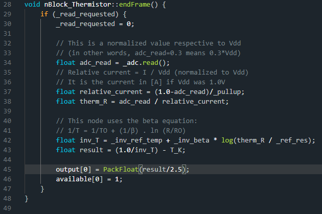

# [38D_PID_test](https://github.com/nBlocksStudioApps/38D_PID_test_FIRMWARE)

Testing program translated from schematic Design [38D_PID_test_SCHEMATIC
](https://github.com/nBlocksStudioApps/38D_PID_test_SCHEMATIC) for the Node [PID](https://github.com/nBlocksStudioNodes/nblocks_pid), controlling a heating element with a PWM driven power MOSFET and a Thermistor for sensing element.

## nBlocksStudio Schematic Design

----

## Setup

>  Left: Hot End and thermocouple probe  
>  Middle: n-3DP board 
>  Right: Overall setup

----

----

## Temperature controll results

>  Left: Stabilized temeprature at 60'Celcious measured by Thermistor  
>  Middle: Temeperature measured with an external Thermocouple probe  
>  Right: Current consumption is stabilized at 163 mA
----

----

## Thermistor Node

Line 45 of thermistor.cpp: has been 'twicked' with division by 2.5. **To be reviewed**

----