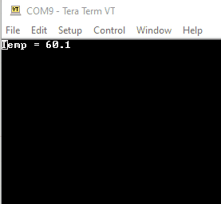

# [38D_PID_test](https://github.com/nBlocksStudioApps/38D_PID_test_FIRMWARE)

Testing program for the nBlocksStudio Node [PID](https://github.com/nBlocksStudioNodes/nblocks_pid). The C++ source code, is automatically generated from the schematic Design [38D_PID_test_SCHEMATIC
](https://github.com/nBlocksStudioApps/38D_PID_test_SCHEMATIC). Controlls a 40W 3D-printer heating element with PWM via power-MOSFET, using a Thermistor for temperature sensing.

## Node [PID](https://github.com/nBlocksStudioNodes/nblocks_pid)

<!-- pagebreak -->

## Node [PID](https://github.com/nBlocksStudioNodes/nblocks_pid) details
PID controller calculates an `error` value as the difference between a measured `Input` and a desired `setpoint`. The controller attempts to minimize the `error` by adjusting an `Output`
(source Wikipedia)

>   *  `Category:` Function
>   *  `HAL:` No Hardware dependencies
>   *  `Status:` Node defined and Compiled
>   *  `Author:` Nikolaos Chalikias

### Inputs/Outputs
>   *  `schematic pin 1` float: `Input` (sensed/measured) value 
>   *  `schematic pin 2`  Input: All PID parameters in form of array `* float`: 9 values: [Kp, Ki, Kd, stime, minOutput, MaxOutput, PIDmode(0.0 or 1.0) , PIDdirection (0.0 or 1.0), Setpoint]. **If used, overrides the default Parameter values**
>   *  `schematic pin 3` uint32_t: `Output` (controlling) value, normalized to 0xFFFF

### Parameters 
>   *  float: **Kp** default
>   *  float: **Ki** default
>   *  float: **Kd** default
>   *  float: **stime**: sampling time in sec default
>   *  float: **minOutput** default
>   *  float: **maxOutput** default: In current implementation it is limited internally to <=1
>   *  string:**PIDMode**:  MANUAL, AUTOMATIC default 
>   *  string:**PIDDirection**: DIRECT, REVERSE default
>   *  float: **setp**: Setpoint default

<!-- pagebreak -->

## nBlocksStudio LoCode NoCode Design

----
* `N1:` The KernelNode is configured for mbed
* `N3:` The ticker is configured to trigger the sensing / control loop, every  200ms
* `N4:` The thermistor Node is configured for:
   *  Microcontroller ADC-pin to be used for measuring the Thermistor voltage.
   *  The Thermistor characteristics and Bias
* `N5:` The PID Node configured with: PID-Coefficients & Temperature set at 60 °C
* `N6:` The PWM Node drives the Heating ellement via a Power-Mosfet from Microcontroller pin P2.5
* `N9, N8` are used for dedugging / Monitoring via USB PC connection and a serial Terminal.

<!-- pagebreak -->

## Setup
>  Hot-End and an external thermocouple probe for temperature validation (red cable) 

>  The PID test program runs in a n-3DP board, with sampling rate 200ms, driving the Hot-End 

----
<!-- pagebreak -->

>  [n-3DP]() motion control/3D printer motherboardc with n-PRO-10 LPC1768 microcontroller board.  
>   *  LPC1768 PWM output drives the power MOSFET which powers the Hot-End (white/red pair of cables )
>   *  The Thermistor is connected to the terrminal Block, filtered and then connected to an LPC1768 ADC input (black pair of cables)
 

----

<!-- pagebreak -->

## Temperature controll results

>  Top: Stabilized temeprature at 60 °C measured by Thermistor  

>  Middle: Temeperature measured with an external Thermocouple probe  

>  Bottom: n-3DP supplied with 19V and the the Current consumption is stabilized at 135 mA (Power  = 2.5W)

<!-- pagebreak -->
## Thermistor Node

Thermistor Node with an added debugging printf(), prints the ADC value for the temperature value it exports. 

The formula used in the Node C++ code is validated and confirmed using an excel spreadsheet and online Thermistor calculators. The theoretical Temperature value for the corresponding ADC measurement is precise. Measuring with the Multimeter indicates a slight difference from the measured voltage from ADC. 

<!-- pagebreak -->

### Conclusion on Thermistor Node precision
The Thermistor Node works good, the ADC Hardware front-end needs some improvement, but the precision is still good for a hot-end temperature control.

----

----

<!-- pagebreak -->
## PID control evaluation

----

After trial and error, the values below result in an acceptable controlling performance.
*  P = 0.2 
*  I = 0.025 
*  D = 0 
*  SamplingTime = 0.2 sec
*  minOutput = 0
*  maxOutput = 1
*  setPoint = 60 °C 

----

Powered-on at a temperature 40 °C, the PID controller tries to fix the temperature to the 60 °C set point fast, so we have an overshoot, then the system is stabilized with a slight oscillation around the 60 °C value. 

Plotted with Arduino plotter.

----

Disturbing the heat balance, by *just slightly-blowing air for 1 sec*, to the hot-end.  
The Sensing and PID system is sensitive enough, to detect and correct the deviation.

----
