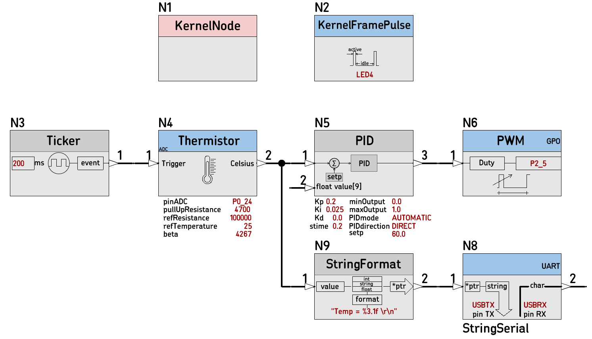

# [38D_PID_test](https://github.com/nBlocksStudioApps/38D_PID_test_FIRMWARE)

Testing program translated from schematic Design [38D_PID_test_SCHEMATIC
](https://github.com/nBlocksStudioApps/38D_PID_test_SCHEMATIC) for the Node [PID](https://github.com/nBlocksStudioNodes/nblocks_pid), controlling a heating element with a PWM driven power MOSFET and a Thermistor for sensing element.

## nBlocksStudio Schematic Design

----

<!-- pagebreak -->

## Setup

>  Left: Hot-End and external thermocouple probe  
>  Right: PID runs in n-3DP board, witrh sampling rate 200ms, driving the Hot-End 

----

----

[n-3DP]() motion control/3D printer motherboardc with n-PRO-10 LPC1768 microcontroller board.  
 *  LPC1768 PWM output drives the power MOSFET which powers the Hot-End (white/red pair of cables )
 *  The Thermistor is connected to the terrminal Block, filtered and then connected to an LPC1768 ADC input (black pair of cables)
 

----

<!-- pagebreak -->

## Temperature controll results

>  Left: Stabilized temeprature at 60 °C measured by Thermistor  
>  Middle: Temeperature measured with an external Thermocouple probe  
>  Right: n-3DP supplied with 19V and the the Current consumption is stabilized at 135 mA (Power  = 2.5W)
----

----

<!-- pagebreak -->
## Thermistor Node

Thermistor Node with an added debugging printf(), prints the ADC value for the temperature value it exports. 

----

The formula used in the Node C++ code is validated and confirmed using and excel spreadsheet and online Thermistor calculators. The theoretical Temperature value for the corresponding ADC measurement is precise. Measuring with the Multimeter indicates a slight difference from the measured voltage from ADC. 

<!-- pagebreak -->

### Conclusion on Thermistor Node precision
The Thermistor Node works good, the ADC Hardware front-end needs some improvement, but the precision is still good for a hot-end temperature control.

----

----

<!-- pagebreak -->
## PID control evaluation

----

After trial and error, the values below result an acceptable controlling performance
*  P = 0.2 
*  I = 0.025 
*  D = 0 
*  SamplingTime = 0.2 sec
*  minOutput = 0
*  maxOutput = 1
*  setPoint = 60 °C 

----

Powered-on at a temperature 40 °C, the PID controller tries to fix the temperature to the 60 °C set point fast, so we have an overshoot, then the system is stabilized with a slight oscillation around the 60 °C value. 

Plotted with Arduino plotter.

----

Disturbing the heat balance, by blowing air for 1 sec to the hot-end and recovery

----
